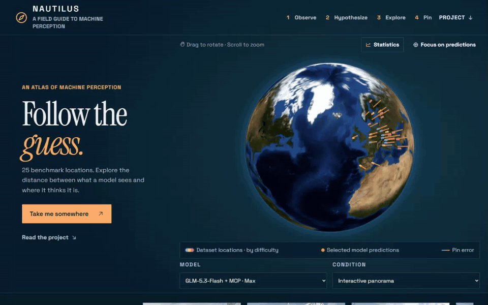
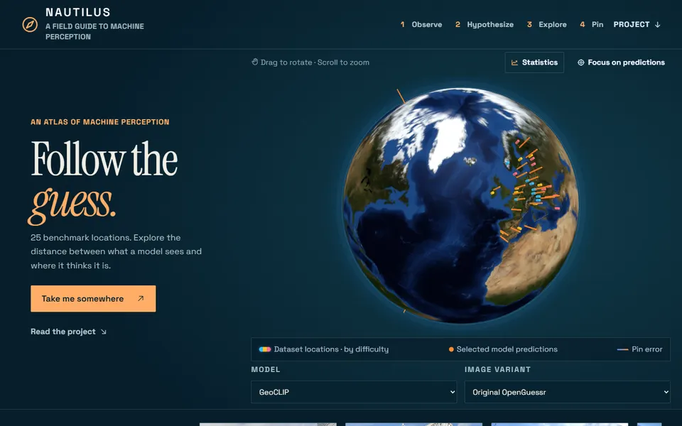
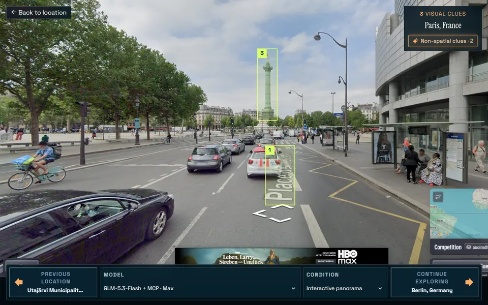
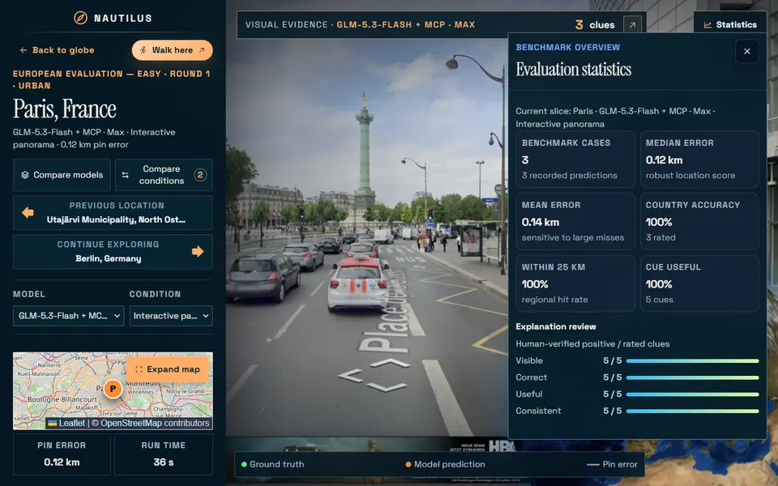

<div align="center">

# NAUTILUS

### Navigational Agentic Understanding Through Interpretable Localization Using Streetscapes

[](https://nautilus-geolocation.ivanukr.chatgpt.site/)
[](docs/paper/NAUTILUS.pdf)
[](demo_and_extension/data/README.md)
[](#run-the-website)

[](https://nautilus-geolocation.ivanukr.chatgpt.site/)

**Follow the guess. Inspect every cue.**

</div>

NAUTILUS evaluates how multimodal agents and vision baselines geolocate the same 25 European places. It pairs every result with inspectable source evidence: competition definitions, predictions, recordings, visual cues, timings, and reproducible analysis.

## At a glance

| | Coverage |
| --- | --- |
| Locations | 25: 8 easy, 9 medium, 8 hard |
| Conditions | Static image / NMPZ and interactive panorama |
| Interactive systems | Gemini, GPT, GLM, and Grok controller variants |
| Static baselines | GeoCLIP, SALAD + OSV-5M (Europe), PLONK OSV-5M (Europe), and Chipoint v2 |
| Interface | Interactive globe, per-location evidence, comparisons, and statistics |

Repeated interactive runs use the same locations. Their means describe run and controller variability, not performance on independent locations.

## Interactive leaderboard

Mean OpenGuessr score across the fixed 25-location benchmark. The maximum is 125,000 points.

| Rank | Model / controller | Runs | Mean score |
| ---: | --- | ---: | ---: |
| 1 | Gemini 3.8 Flash · high, aided | 3 | **120,391** |
| 2 | Gemini 3.7 Flash · high, aided | 3 | **120,203** |
| 3 | Gemini 3.7 Flash · medium, aided | 3 | **120,153** |
| 4 | Gemini 3.8 Flash · medium, aided | 3 | **119,804** |
| 5 | GPT-6 Astra · low | 3 | **119,246** |
| 6 | GPT-5.6 Sol · max | 3 | **111,260** |
| 7 | GLM-5.3-Flash + MCP · max | 3 | **110,980** |
| 8 | GPT-5.6 Sol · xhigh | 3 | **110,808** |
| 9 | Grok 4.6 + MCP · xhigh, composite | 3 | **105,026** |
| 10 | Grok 4.6 · xhigh, raw GUI | 3 | **74,955** |
| 11 | Gemini 3.7 Flash · high, unaided | 1 | **64,350** |


## Static baselines

Results below use the same 25 canonical starting images. Values are mean / median final-prediction geodesic error; lower is better.

| Model | Overall Mean / Median error | Within 200 km |
| --- | ---: | ---: |
| PLONK OSV-5M (Europe) | **501.8 / 167.8 km** | **56%** |
| Chipoint v2 | 536.2 / 312.1 km | 32% |
| GeoCLIP | 1,183.3 / 224.2 km | 44% |
| SALAD + OSV-5M (Europe) | 1,308.5 / 929.2 km | 20% |

The runnable implementations and source CSVs are grouped under [`baselines/`](baselines/). Website-ready normalized records are derived from those CSVs during the data build.

## Explore the evidence

The public atlas connects every aggregate result to the scene, prediction, and human-reviewed evidence behind it.

| Prediction atlas | Visual cue inspection | Per-location statistics |
| --- | --- | --- |
| [](https://nautilus-geolocation.ivanukr.chatgpt.site/) | [](https://nautilus-geolocation.ivanukr.chatgpt.site/#case=europe-easy--loc-001&model=GLM-5.3-Flash+%2B+MCP+%C2%B7+Max&condition=interactive-panorama) | [](https://nautilus-geolocation.ivanukr.chatgpt.site/#case=europe-easy--loc-001&model=GLM-5.3-Flash+%2B+MCP+%C2%B7+Max&condition=interactive-panorama) |
| Rotate the globe and follow every prediction path. | Open spatial and text-only cues in the source scene. | Compare repeated runs, error, accuracy, and cue quality. |

## Repository guide

```text
NAUTILUS/
├── demo_and_extension/   website, data pipeline, recorder, and MCP controller
│   ├── data/             canonical benchmark data and evidence
│   ├── src/              atlas frontend
│   ├── scripts/          import, build, and validation tools
│   ├── extension/        OpenGuessr research recorder and helper extension
│   ├── openguessr-mcp/   benchmark-safe coordinate actuator
│   └── tests/            automated project tests
├── baselines/            four static-image model pipelines and source results
└── analysis/             reproducible distance analyses and derived reports
```

Each major folder has a focused README:

- [`demo_and_extension/README.md`](demo_and_extension/README.md) — development and recording workflow.
- [`demo_and_extension/data/README.md`](demo_and_extension/data/README.md) — data ownership, provenance, and generated outputs.
- [`baselines/README.md`](baselines/README.md) — baseline setup, result layout, and website import.
- [`analysis/README.md`](analysis/README.md) — reproducible analytical outputs.

## Run the website

Requirements: Node.js 20+ and npm.

```powershell
cd demo_and_extension
npm ci
npm ci --prefix openguessr-mcp
npm run verify
npm start
```

Open `http://127.0.0.1:4173`. Build a deployable copy with `npm run build:site`; output goes to the ignored `dist/` directory.

## Data rules

- Location definitions in `demo_and_extension/data/competitions/` are the source of truth.
- Raw and curated evidence belongs under `demo_and_extension/data/`, not at the repository root.
- Baseline result CSVs under `baselines/*/results*/` are the source for static-baseline predictions.
- `demo_and_extension/data/generated/` is rebuildable. Never hand-edit it.
- Large model caches, virtual environments, downloaded galleries, local captures, and build output stay untracked.

Rebuild normalized data with:

```powershell
cd demo_and_extension
npm run data:build
```

Run the independent distance analysis from the repository root with:

```powershell
python .\analysis\calculate_agent_distance_stats.py
```

## Verification

```powershell
cd demo_and_extension
npm run verify
npm run build:site
```

`npm run verify` checks the data build, browser extension, frontend behavior, static-baseline import, and nested OpenGuessr MCP tests.

## Evidence boundary

The MCP controller may place and verify coordinates selected by a model, but it must not expose correct locations, hidden page state, network data, or target coordinates. Scores are official OpenGuessr points. Kilometer analyses are independently recomputed from published coordinates where available and explicitly identify fallback evidence.
